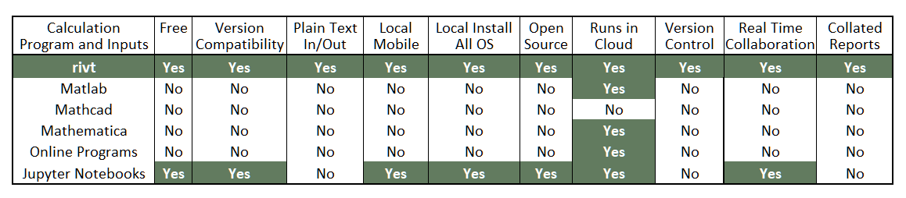

<table style="width:75%">
<colgroup>
  <col width="25%" />
  <col width="25%" />
  <col width="25%" />
</colgroup>
<thead>
<tr class="header">
  <th style="text-align: center;border:none;background-color:#959396"><a href="https://rivtdocs.net"><b>rivtDocs (stack)</b></a></th>
  <th style="text-align: center;border:none"><a href="https://rivtcode.net"><b>rivt (code)</b></a></th>
  <th style="text-align: center;border:none"><a href="https://rivtdocs.net/search"><b>rivtSearch (GitHub)</b></a></th>
</tr>
</thead>
<tbody>
<tr>
  <td style="text-align:center;border:none"></td>
  <td style="text-align: center;border:none"></td>
  <td style="text-align: center;border:none"></td>
</tr>
</tbody>
</table>

----------------------------
### Reuse Docs and Calcs Anywhere
----------------------------

## Introduction

Engineering documents and calculations include tables, figures and calculations
in addition to text. They are often presented in letter or report formats.
Recent developments in open source software tools dramatically improve the ease
with which these documents can be compiled and shared. This has important
implications for engineering design quality and productivity.

Many engineering technologies in the 21st century are evolving slowly. Design
procedures are often fixed for decades in standard codes, with little or no
change. Good engineering work now lies, not so much in technological
innovation, but in understanding a range of established technologies well
enough to efficiently and cost-effectively combine them to fit project
requirements. Calculation documents are the working papers that describe
precisely how the combinations fit. Being able to easily cut and paste common
ideas from previous projects lets an engineer explore more options when
improving performance, reducing cost or responding to market changes.

Engineering professions have an opportunity to produce large, general
calculation libraries that can be reused and recombined as needed. The model of
shared, incremental improvement has proven very effective in software
programming where large chunks of code are repurposed and recombined. Although
software code is only text, the extension of aspects of this approach to more
general engineering documents seems equally promising.

A number of powerful engineering calculation programs exist, but they
incorporate barriers to widespread sharing. The first is high initial and
recurring software costs, required by constantly changing file formats that
require program upgrades or subscriptions to maintain file compatibility. In
addition, because files and interfaces are incompatible between different
programs, multiple software purchases are required along with the requisite
learning curves. Furthermore, current software does not easily generate reports,
version control or integrate output from external programs.

**Program Comparison**

Taken together these barriers prevent widespread sharing and result in nearly
identical calculations being rewritten many times. **rivt** and **rivtDocs** 
were developed as an an open source markup language and software stack that
minimizes these barriers and promotes reuse.

## **rivtDocs** Overview

**rivtDocs** is an integration of four open source programs and technologies
(listed below) that process **rivtText** through the **rivt** package. **rivt**
is a plain text, human readable, calculation markup language derived from
restructuredText. 

**rivt** can be installed on the desktop or run in the cloud. The minimum
software needed to run **rivt** is a Python installation with 8 additional
libraries and a plain text processor. The installation required for efficient
workflow and formal document production includes:

1. Python 3.8 or higher + **rivt** + other libraries
2. VSCode + extensions
3. LaTeX
4. Github

**rivtDoc** installs as a system level program or a portable self contained
folder, and is available for every OS platforms. It can also be run in the
cloud using GitHub CodeSpaces or other cloud service providers. Installation
details are provided in the user manual.

## **rivt** Overview

**rivt** is a Python package providing an API for **rivtText**, a simple,
readable document markup language designed for calculations. **rivtText** wraps
and extends [reStructuredText(reST).](https://docutils.sourceforge.io/rst.html). 
Formatted output documents can be UTF8, HTML and PDF from the same **rivtText** file.

The program design prioritizes three principles:

- *Cut and Paste Anything* - **rivt docs** are plain text
- *Integration* - **rivt** is built on Python which connects almost everywhere
- *Legibility* - **rivtText** uses less than 30 intuitive terms and commands

The **rivt** API uses fixed file and folder conventions for input and output to
simplify formatting, navigation, and report assembly. Folder names are shown in
brackets. Fixed folder and file names and prefixes are shown italicized.

**rivt Folder Structure**

- **[*rivt*_project_name]** (user project_name)
    - **[text]**
        - **[*rv00_config*]** (calc configuration data)
            - units.py
            - config.py
        - **[*rv0101*_division_name]**  (folder report division name)
            - *rv0101*_doc_name.py (file name) 
            - README.txt (doc output file)
            - chart.csv (doc source file)
            - functions.py (doc function file)
        - **[*rv0102*_division_name]** 
            - *rv0102*_doc_name.py
            - README.txt
            - chart1.csv 
            - functions1.py 
         - **[*rv0201*_division_name]**
            - r0201_doc_name.py
            - README.txt
            - paragraph.txt
   - **[resource]**
        - **[r00]** (report configuration data)
            - pdf_style.sty
            - project_data.syk
            - *report.txt*
        - **[r01]**
            - image1.jpg
        - **[r02]**
            - image2.jpg
            - attachment.pdf    
   - **[reference]**
        - **[user_folders]** (files not used in docs)
            - file1
            - file2
    - **[report]** (pdf output files)
        - r0101_loads.pdf
        - r0102_foundation.pdf
        - r0201_floor.pdf
        - r0202_roof.pdf
        - report.pdf
    - **[site]** (html output files)
        - **[resources]**
            - image1.png
            - image2.png
        - index.html
        - s0101_loads.html
        - s0102_foundation.html
        - s0201_floor.html
        - s0202_roof.html

The four top-level folder names (text, resource, report and site) are required.
Other file names are user determined using the specified prefixes. Underscores
that separate words in file and folder names are stripped out when used as
document and division names in the report. The API is designed so that only
files in the text folder are uploaded for version control and sharing. They are
the essential core of the calculation - text, equations, functions, tables and
image references. Files in the resource folder are not shared and are typically
binary files such as images, pdf attachments and proprietary data (e.g. client
contact information and costs). This folder and file structure makes it easy to
share and assert version control on the primary calculation inputs. 

A rivt file is a Python file that imports rivtapi and calls one of four
functions on rivt-strings. Rivt-strings are free-form plain text strings
enclosed in triple quotes that include commands and tags defining the
calculation and formatting. rvddnn_docname.py is the file name where dd is the
division number, nn is the subdivision number and ddnn is the document number.
The text folder includes all of the plain text input files and output doc
files.

A rivt project is typically started by copying from a similar existing project.
The text folder will be available. The resource folder may have to be
recreated. In summary, rivt reads string functions in a .py file as input and
outputs a plain text document to the text folder. Fully formatted pdf or html
files are output to the report or site folders respectively. A simple text
editor may be used, but writing speed is dramatically improved if a
full-featured IDE (i.e. VSCode) is used. rivt_strings may be executed
interactively using the standard cell tag (# %%). Execution steps are
summarized as :

<pre> 
                    ---------------------------------
                    |     Edit and run rivt file    |
                    |     or run interactively.     |
                    |                               |
                    |         string types:         |
                    |       R(), I(), V(), T()      |
                    ----------------+----------------
                                   ||
 -----------------  ----------------------------------  ---------------
 |   Process     |  |   Working in interactive IDE?  |  |  Process    |
 |   cell to     |  |   (e.g. VSCode, Spyder, Pyzo)  |  |  file       |
 |   terminal    <--+ YES                         NO +-->             |
 -------+---------  ----------------------------------  -------+-------
       ||           ==================================         ||
       ||           |    Write utf-8, reST, TeX      |         ||
        +===========>    calc to file                <=========+
                    |================+===============|
                                    ||
 =================  +--------------------------------+
 | Write HTML    |  |                                |  -----------
 | or PDF doc    |  |         Write docs?            |  |   End   |
 | files         <==+ YES                         NO +==>         |
 =====+===========  ----------------------------------  -----------
     ||
     ||            +--------------------------------+  -----------
     ||            |         Write report?          |  |   End   |
      +============>               YES           NO +==>         |
                   +----------------+---------------+  -----------
                                   ||
                   ==================================
                   |    Write PDF report file       |
                   ==================================
</pre>

rivtDocs can be installed in several ways:

- Local install with configuration of individual components.

- Portable install through pre-configured zip file (Windows only).

- Installation on a remote server.

[Rivt User Manual](http://www.rivtmanual.net>)
